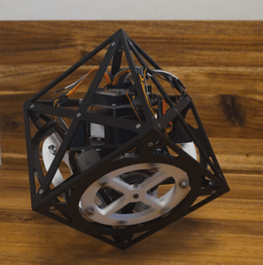
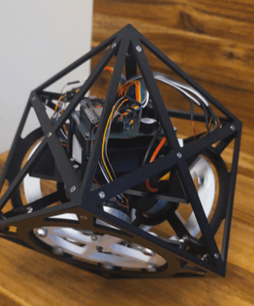
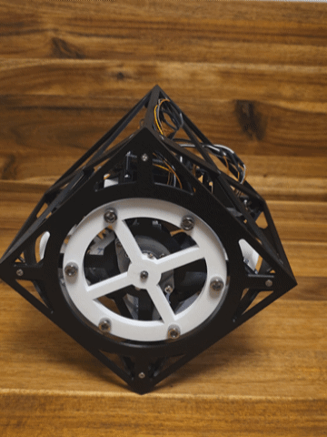
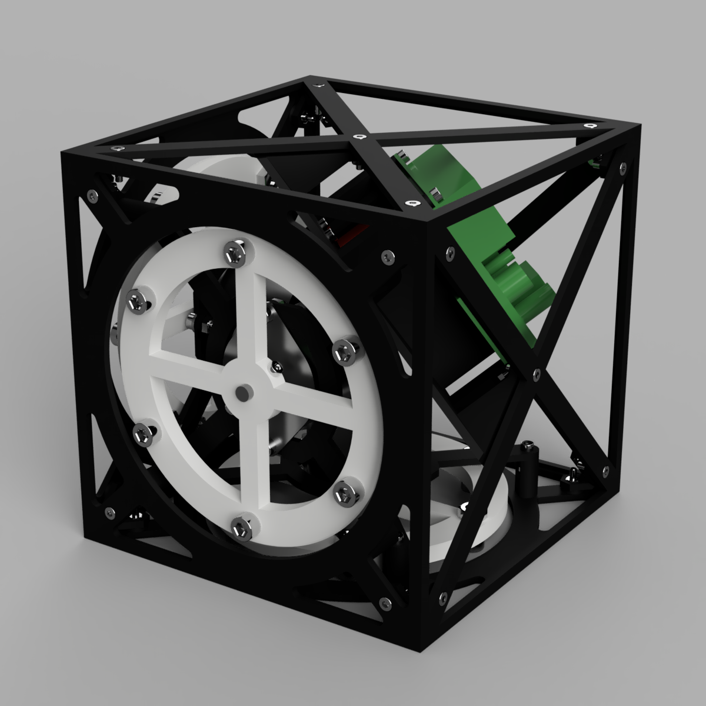

# Cubilox Mk1

**A self-balancing reaction wheel cube that balances on its edge and on its corner.**
Three brushless motors with reaction wheels, an ESP32 and an IMU keep the cube upright – with
self-designed 3D-printed parts, self-built electronics and self-written control firmware.

<p align="center">
  
</p>

## Key features

- **Vertex balancing** on one corner with three reaction wheels, stable for several minutes
- **Edge balancing** with one reaction wheel and automatic balance point trim
- **3D controller** that separates tilt and yaw (rotation about the vertical axis), so the wheel
  momentum about the vertical axis does not build up
- **One-time calibration by hand** (`edge` / `vertex`), stored in flash and kept after power loss
- **Wireless tuning and calibration over Bluetooth**, all gains adjustable at runtime
- **Battery monitoring** with low-voltage warning and start lock-out
- Fully **3D-printable** mechanics (PLA, ~283 g, ~14 h print time)
- Detailed **[technical documentation (PDF)](docs/cubilox_mk1_documentation.pdf)**

<p align="center">
  
  &nbsp;&nbsp;
  
</p>

## How it works

A cube standing on an edge or a corner is an inverted pendulum: it falls over unless it is
actively stabilised. The Cubilox Mk1 contains three reaction wheels with mutually orthogonal axes.
When a motor accelerates its wheel, the wheel pushes back on the cube with the opposite torque.
The ESP32 estimates the tilt of the cube from the accelerometer and gyroscope of the IMU
(complementary filter) and computes, every 5 ms, how strongly each wheel has to be accelerated.
The controller feeds back the tilt angle, the tilt rate and the wheel speed. The wheel speed term
keeps the wheels from spinning up until the motors saturate. On the corner, the controller works
with 3D vectors and handles the rotation about the vertical axis separately.

The physics, the control laws and the development history are explained in the
[documentation](docs/cubilox_mk1_documentation.pdf).

## Hardware overview

<p align="center">
  
</p>

| Component | Part |
|---|---|
| Microcontroller | ESP32 development board (HW-394, ESP32-32D, USB-C) |
| IMU | MPU-6500 breakout board (labelled MPU-9250/6500/9255) |
| Motors | 3 × Nidec 24H brushless motor with integrated driver and encoder (8-pin version) |
| Battery | 3S LiPo, 11.1 V, 1000 mAh, XT30 |
| Power | mini DC-DC buck converter (5–30 V in, 5 V out), buffer capacitors |
| Other | active 5 V buzzer, battery voltage divider (33 kΩ / 10 kΩ), 60 × 80 mm prototype board |
| Mechanics | 3D-printed PLA frame and reaction wheels, M3/M4/M6 screws and nuts |
| Size and mass | 157 mm edge length, 1036 g |

The full part list is in [`BOM.csv`](BOM.csv), the wiring in
[`hardware/electronics/wiring.md`](hardware/electronics/wiring.md) and the schematic in
[`hardware/electronics/cubilox_mk1_schematic.pdf`](hardware/electronics/cubilox_mk1_schematic.pdf).

### 3D files

> **The 3D files are available on MakerWorld:** [Cubilox Mk1 – Self-Balancing Cube on its Corner](https://makerworld.com/de/models/3406349-cubilox-mk1-self-balancing-cube-on-its-corner#profileId-3879241)

## Repository structure

```
├── firmware/cubilox_mk1/   Arduino sketch (ESP32)
│   ├── cubilox_mk1.ino     setup, sensor filters, state machine, controllers
│   ├── config.h            pins, gains, limits
│   ├── calibration.ino     gyro, edge and vertex calibration, flash storage
│   ├── commands.ino        command interface (USB / Bluetooth)
│   └── hardware.ino        motors, encoders, battery, buzzer, motor test
├── hardware/electronics/   schematic (PDF) and wiring tables
├── docs/                   LaTeX documentation, figures and the compiled PDF
├── media/                  GIFs and renders for this README
├── BOM.csv                 bill of materials
├── NOTICE.md               licenses and third-party software
└── LICENSE                 MIT (firmware)
```

## Build and flash

**Requirements**

- [Arduino IDE 2](https://www.arduino.cc/en/software)
- Arduino core for the ESP32, version 3.x (tested with 3.3.10) – install *esp32 by Espressif
  Systems* in the Boards Manager
- Library **MPU6050_light** (tested with 1.2.1) – install it in the Library Manager

**Flashing**

1. Open `firmware/cubilox_mk1/cubilox_mk1.ino` in the Arduino IDE.
2. Select the board **ESP32 Dev Module** with the default partition scheme.
3. Connect the ESP32 via USB and click *Upload*.

Or with `arduino-cli`:

```bash
arduino-cli compile --fqbn esp32:esp32:esp32 firmware/cubilox_mk1
arduino-cli upload  --fqbn esp32:esp32:esp32 -p <port> firmware/cubilox_mk1
```

## First start and calibration

1. Connect a charged battery and lay the cube on any side. It calibrates the gyroscope (~3 s) and
   signals with a long beep that it is ready.
2. Connect via Bluetooth to **`Cubilox_Mk1`** with a serial terminal app (e.g. *Serial Bluetooth
   Terminal* on Android – the ESP32 uses Bluetooth Classic, which iPhones do not support), or use
   the USB serial monitor at 115200 baud.
3. Send `edge`, then balance the cube by hand on an edge parallel to the axis of motor X. After 7 s
   it measures for 3 s and stores the balance point.
4. Send `vertex` and do the same on the corner.
5. Place the cube on the edge or corner near the balance point – it starts by itself.

The calibration is stored permanently. Balancing by hand finds the real balance point (centre of
mass above the pivot), which turned out to be the key to stable corner balancing.

### Commands

| Command | Function |
|---|---|
| `help` | list of commands |
| `status` | gains, calibration status, battery voltage |
| `edge` / `vertex` | calibrate the edge / vertex balance point |
| `vk1 95` | set a gain (`vk1 vk2 vk3 vyd vyw vtrim ek1 ek2 ek3 trim`) |
| `save` / `reset` | store the gains in flash / restore the defaults |
| `debug 0` / `debug 1` | detailed log output off / on |
| `motortest` | test pulse on every motor, recommends the motor signs |
| `vbatcal 12.6` | optional: fine-tune the battery measurement to a multimeter reading |

A tuning guide that explains every gain is part of the
[documentation](docs/cubilox_mk1_documentation.pdf).

## Documentation

The complete technical documentation – working principle and physics, mechanical design,
electronics, firmware and control laws, getting started, tuning, assembly, results and lessons
learned – is available as a PDF: **[docs/cubilox_mk1_documentation.pdf](docs/cubilox_mk1_documentation.pdf)**.
The LaTeX sources are in [`docs/`](docs/).

## Credits and acknowledgements

- The Cubilox Mk1 was designed and built by **William Rosenberg** – mechanics, electronics and
  firmware are entirely self-made.
- It is directly inspired by the **[self-balancing cube of remrc](https://github.com/remrc/Self-Balancing-Cube)**,
  which uses the same Nidec 24H motors and from which I learned a lot. Thank you!
- The scientific origin of reaction wheel balancing cubes is the **Cubli** of ETH Zurich:
  M. Gajamohan, M. Merz, I. Thommen and R. D'Andrea, *"The Cubli: A cube that can jump up and
  balance"*, IROS 2012.
- The IMU is read with the [MPU6050_light](https://github.com/rfetick/MPU6050_light) library by
  Romain Fétick.

## License

Copyright © 2026 William Rosenberg.

| Part | License |
|---|---|
| Firmware and source code (`firmware/`) | [MIT](LICENSE) |
| Schematic and wiring (`hardware/`) | [CERN-OHL-P-2.0](hardware/LICENSE) |
| Documentation (`docs/`) | [CC BY 4.0](docs/LICENSE) |
| Photos, renders and animations (`media/`), BOM | [CC BY 4.0](media/LICENSE) |

The licenses of the libraries used by the firmware are listed in [`NOTICE.md`](NOTICE.md).
